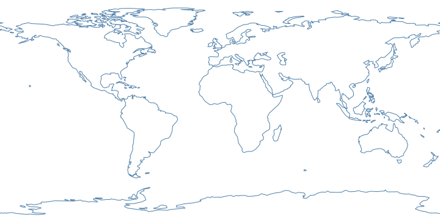

# portolani

**The whole world's coastline in 8 KB.**
[Move the slider and watch it happen.][demo]

[][demo]

That map is 128 lines and 2 709 points — smaller than most website logos,
small enough to store on a microcontroller with room to spare. The [demo][demo]
redraws it in your browser at whatever detail level you drag to, with live
byte counters, so you can see for yourself that nothing worth having was
thrown away. This package is the tool that makes the data:

```shell
npx portolani --source ne_110m_coastline --out coastline.json
```

Generate **portolani**: simplified, delta-encoded coastline and land geometry,
small enough to ship inside a web page, with the provenance to reproduce them
exactly. No install, no dependencies, no API key. Run it again next year
against the same Natural Earth release and you get the same bytes.

## Why this exists

Every project that draws a map without a tile server re-solves the same
problem: get a coastline, make it small enough to ship, decode it in the
browser. The usual answers are a 55 KB TopoJSON plus a decoder library, or a
half-hour with `ogr2ogr` and a script nobody else can re-run.

This is that script, published. The output — **a portolano** — is a plain
JSON document with a written [format spec](docs/portolano-format.md), so the
decoder on the other end can be nine lines in whatever language the display
runs, including a microcontroller with no JavaScript anywhere near it.

The reason it is a package rather than a private script is
[reproducibility](docs/portolano-format.md#4-provenance). Simplification is
lossy and has knobs. A private script means *trust me*; a published tool with
the knob values stamped into every file it writes means anyone can re-run it
and diff.

## Install

Nothing to install — `npx portolani` fetches and runs it. If you would rather
have it around:

```shell
npm install --save-dev portolani
```

Node 20 or newer. Zero runtime dependencies, by policy.

## Usage

```
portolani --source <layer|url|file> [options]
```

| Option | | Default | |
| --- | --- | --- | --- |
| `--source` | `-s` | *required* | A named Natural Earth layer, an `https` URL to a GeoJSON document, or a local file path. `--sources` lists the names. |
| `--ref` | | `v5.1.2` | Which Natural Earth release named layers come from. |
| `--kind` | `-k` | from the layer | `lines` or `polygons`. |
| `--tolerance` | `-t` | `0.25` | Douglas–Peucker tolerance, in degrees. `0` keeps every point. |
| `--precision` | `-p` | `1` | Decimal places kept per coordinate. |
| `--min-extent` | `-m` | `1` | Drop shapes whose bounding box is smaller than this on both sides. `0` keeps every island. |
| `--bbox` | `-b` | none | `west,south,east,north`. West may exceed east to wrap the antimeridian. |
| `--format` | `-f` | `json` | `json`, `esm`, or `cjs`. |
| `--out` | `-o` | stdout | Where to write. |
| `--fixtures` | | none | Also write decoder self-check vectors. |
| `--pretty` | | off | Indent the JSON. |

### The two knobs that matter

**`--tolerance`** is how far, in degrees, the simplified line may stray from
the original. **`--precision`** is how many decimal places survive. They are
independent and it is easy to waste one on the other: storing three decimals
of a line simplified to a quarter degree records rounding noise very
precisely.

Match them. A useful rule is *precision one step finer than tolerance*:

| Tolerance | Precision | Good for |
| --- | --- | --- |
| `0.25` | `1` | Annotating a coarse data grid — space weather, a global model, anything with cells wider than a degree. |
| `0.1` | `2` | A world map the reader looks at rather than through. |
| `0.02` | `3` | Regional. Recognisable at a few hundred miles across. |
| `0.005` | `4` | Coastal pilotage scale. Use `--bbox`; the whole world at this fidelity is megabytes. |

**`--min-extent`** decides how much of the world's island count you are
willing to pay for. At the default `1` you get continents and large islands.
At `0` you get every rock Natural Earth knows about, which at 10 m is most of
the file.

### Regional extracts

`--bbox` clips rather than filters: lines are cut at the boundary and polygons
are clipped to it, so a regional file costs regional bytes.

```shell
# The Salish Sea at pilotage scale, every island kept.
npx portolani -s ne_10m_coastline -b -125.5,47,-122,50 -t 0.005 -p 4 -m 0 -o salish.json
# 31 lines, 1018 points, 5.4 KB
```

A box whose west is east of its east wraps the antimeridian, and comes out cut
at ±180 — the seam every renderer already knows how to handle:

```shell
npx portolani -s ne_10m_coastline -b 170,-20,-170,-10 -o fiji.json
```

### Lines or polygons

`ne_*_coastline` layers hold lines; `ne_*_land` layers hold polygons with
their holes intact. The difference is whether you can fill:

```shell
npx portolani -s ne_110m_coastline -o coast.json    # stroke the shoreline
npx portolani -s ne_110m_land -o land.json          # shade the land
```

Passing `--kind lines` to a polygon layer flattens it to strokeable rings.
There is no way to go the other direction; a line layer has no interior.

### Measured output

Natural Earth v5.1.2, on this machine, JSON on disk including the provenance
block (about 800 bytes of it):

| Command | Shapes | Points | Bytes |
| --- | --- | --- | --- |
| `-s ne_110m_coastline` | 128 | 2 709 | 8 151 |
| `-s ne_110m_land` | 121 | 2 764 | 8 445 |
| `-s ne_50m_coastline -t 0.1 -p 2` | 268 | 9 917 | 36 222 |
| `-s ne_10m_coastline -t 0.02 -p 3 -m 0.1` | 2 724 | 88 069 | 350 919 |

The finest of those takes about two and a half seconds, most of it spent
fetching 10 MB of source.

## Reading a portolano

The format is [specified](docs/portolano-format.md) rather than left to the
code. In JavaScript, [`coast-wright`][cw] decodes and draws it. Everywhere
else, the decoder is short enough to write from §3 of the spec — and
`--fixtures` gives you the vectors to prove you wrote it right, including the
two mistakes everybody makes: reading `[lat, lon]` because that is what
Google's polyline format stores, and forgetting that the encoding alphabet
contains a backslash that JSON escapes.

```js
import { decodeRingDegrees } from 'portolani/codec'

const portolano = await (await fetch('coastline.json')).json()
const rings = portolano.geometry.map((ring) =>
  decodeRingDegrees(ring, portolano.encoding.precision)
)
```

`portolani/codec` is the reference implementation of §3, exported so that the
generator can be checked against the same code a consumer runs. For drawing —
seam handling, projections — use [`coast-wright`][cw], whose
[own demo][cwdemo] draws one portolano through fourteen projections; for
geometry somebody already generated, [`coastlines`][cl].

## Programmatic use

```js
import { resolveSource, loadSource, buildPortolano, emit } from 'portolani'

const source = resolveSource('ne_110m_coastline')
const { geojson, sha256, bytes } = await loadSource(source)
const portolano = buildPortolano({
  geojson,
  source: { ...source, sha256, bytes },
  options: { kind: 'lines', tolerance: 0.25, precision: 1, minExtent: 1 },
  generator: { name: 'my-build', version: '1.0.0' },
})
```

`buildPortolano` is pure: no network, no clock. It is the shape a package
generating several profiles in one build wants.

## Data source and licence

Named layers come from [Natural Earth][ne] via the
[natural-earth-vector][nev] repository, pinned to a release rather than a
branch. Natural Earth is **public domain**: no permission needed, no
attribution required. It is credited anyway, in the banner of every generated
module and in the `provenance` block of every generated document:

> Made with Natural Earth. Free vector and raster map data @ naturalearthdata.com

If you point `--source` at something else, its licence is yours to honour;
`portolani` records what it is told and asserts nothing.

The generator itself is MIT.

[demo]: https://mark-brannan.github.io/portolani/
[ne]: https://www.naturalearthdata.com/
[nev]: https://github.com/nvkelso/natural-earth-vector
[cw]: https://github.com/mark-brannan/coast-wright
[cwdemo]: https://mark-brannan.github.io/coast-wright/
[cl]: https://github.com/mark-brannan/coastlines
